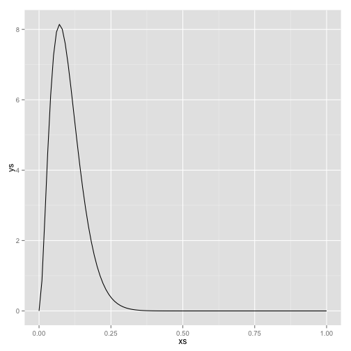

# Applied Bayesian Analysis 

## Practical Class 1: Conjugate Bayesian Inference using R and Learn-Bayes

## 1. Surgery example from lectures

Load the relevant libraries used throughout this analysis.

```r
library(LearnBayes)
library(pscl)
library(ggplot2)
```


Plot the prior distribution.

```r
prior <- c(3, 27)
xs <- seq(0, 1, length = 100)
ys <- dbeta(xs, 3, 27)
qplot(xs, ys, geom = "line")
```

 


Find the 95% symmetric confidence interval.

```r
int1 <- qbeta(c(0.025, 0.975), 3, 27)  # symmetric 95% interval
int1
```

```
## [1] 0.02186 0.22766
```

```r
width1 <- int1[2] - int1[1]
```


Find a 95% highest density interval.

```r
int2 <- betaHPD(3, 27, 0.95, plot = TRUE)
```

 

```r
int2
```

```
## [1] 0.01206 0.20572
```

```r
width2 <- int2[2] - int2[1]
```


Reduction in width of interval with HPD.

```r
100 * (width1 - width2)/width1  #  % 
```

```
## [1] 5.901
```


Probability the true mortality risk is greater than 0.2.

```r
1 - pbeta(0.2, 3, 27)  #upper tail area
```

```
## [1] 0.05203
```


What is the predictive probability of observing at least 6 deaths in the next 20 patients?

```r
pbetap(prior, 20, 0:20)  # beta-binomial predictive distribution
```

```
##  [1] 1.983e-01 2.587e-01 2.184e-01 1.489e-01 8.833e-02 4.711e-02 2.298e-02
##  [8] 1.034e-02 4.309e-03 1.663e-03 5.933e-04 1.948e-04 5.843e-05 1.586e-05
## [15] 3.846e-06 8.172e-07 1.483e-07 2.210e-08 2.540e-09 2.005e-10 8.169e-12
```

```r
sum(pbetap(prior, 20, 6:20))  # sum to give upper tail area
```

```
## [1] 0.04016
```

```r
predplot(prior, 20, 6)
```

 


We do 10 operations and all the patients survive. Plot the prior, likelihood, and posterior distribution for the risk.

```r
data <- c(0, 10)  # no. 'successes, failures' (note that here 'failure' is a survival!)
triplot(prior, data)  # posterior is beta[3,37]
```

 


What was our prior predictive probability for observing so few deaths?

```r
pbetap(prior, 20, 0)  # prob no deaths
```

```
## [1] 0.1983
```


What is the posterior mean and 95% highest posterior density interval for the mortality
risk?

```r
betaHPD(3, 37, 0.95, plot = TRUE)  # seem to need to calculate posterior parameters yourself
```

 

```
## [1] 0.008645 0.155751
```


What is the posterior probability that the true mortality rate is greater than 0.2?

```r
1 - pbeta(0.2, 3, 27)  # tail area of posterior
```

```
## [1] 0.05203
```


Suppose 20 more patients will be operated upon. What is the probability that at least
2 of them die?

```r
post <- prior + data  # posterior is beta[3,37]
sum(pbetap(post, 20, 2:20))  # upper tail area
```

```
## [1] 0.4177
```


## 2. Is the coin biased? Bayes with a discrete prior distribution


```r
p <- c(0, 0.1, 0.2, 0.3, 0.4, 0.5, 0.6, 0.7, 0.8, 0.9, 1)  # possible values of the 'chance'
prob <- c(0.02, 0.02, 0.02, 0.02, 0.02, 0.8, 0.02, 0.02, 0.02, 0.02, 0.02)  # prior distribution
n <- 10
s <- 0:10
y <- pdiscp(p, prob, n, s)  # predictive distribution for a discrete prior (mixture of binomials)
qplot(s, y)  # crude way of plotting predictive distribution
```

 

Loosely, 0 heads is more likely than 1 head, as if $\theta=0$ then certain to get 0 heads, and may get 0 even if $\theta > 0$.

Probability of 8 or more heads.

```r
sum(pdiscp(p, prob, n, 8:10))
```

```
## [1] 0.1072
```


You flip the coin 10 times and it comes down heads in 8 flips. What is your posterior
probability that the coin is unbiased ($\theta = 0.5$)?

```r
data <- c(8, 2)  # 8 successes and 2 failures
y <- pdisc(p, prob, data)  # posterior distribution with discrete prior
qplot(p, y)  # crude way of plotting posterior distribution
```

 

```r
y[6]  # posterior probability of a fair (unbiased) coin
```

```
## [1] 0.6709
```


## 3. Drug

What is the posterior mean and 95% highest density interval for the response rate?

```r
m <- 0.4  # mean
v <- 0.1 * 0.1  # variance
a <- m * (m * (1 - m)/v - 1)  # prior 'number of successes'
a
```

```
## [1] 9.2
```

```r
b <- (1 - m) * (m * (1 - m)/v - 1)  # prior 'number of failures'
b
```

```
## [1] 13.8
```

```r
prior <- c(a, b)
data <- c(15, 5)  # 15 successes and 5 failures
post <- prior + data  # posterior parameters
post
```

```
## [1] 24.2 18.8
```

```r
post[1]/(post[1] + post[2])  # posterior mean (properties of beta distribution)
```

```
## [1] 0.5628
```

```r
betaHPD(24.2, 18.8, 0.95, plot = TRUE)
```

 

```
## [1] 0.4162 0.7077
```


Examine the prior and likelihood.

```r
triplot(prior, data)
```

 


What was the prior predictive probability of observing at least 15 successes?

```r
sum(pbetap(prior, 20, 15:20))  #  prior predictive probability of getting at least 15 successes
```

```
## [1] 0.01526
```


```r
m <- 0.8  # alternative prior for 'winners'
v <- 0.1 * 0.1
a2 <- m * (m * (1 - m)/v - 1)  #
a2
```

```
## [1] 12
```

```r
b2 <- (1 - m) * (m * (1 - m)/v - 1)  #
b2
```

```
## [1] 3
```


Plot this 'mixture' prior distribution

```r
x <- seq(0, 1, len = 100)
y <- 0.95 * dbeta(x, a, b) + 0.05 * dbeta(x, a2, b2)
qplot(x, y, geom = "line")  # mixture prior distribution
```

 


What is the posterior probability that the drug is a 'winner'?

```r
probs <- c(0.95, 0.05)  # mixing probs
beta.par1 <- c(a, b)  # beta params for 'main prior' (model 1)
beta.par2 <- c(a2, b2)  #beta params for 'main prior' (model 2)
betapar <- rbind(beta.par1, beta.par2)  # create matrix of beta-parameters
binomial.beta.mix(probs, betapar, data)  # function that outputs posterior weights on two 'models', and within-model posterior parameters
```

```
## $probs
## beta.par1 beta.par2 
##    0.6048    0.3952 
## 
## $betapar
##           [,1] [,2]
## beta.par1 24.2 18.8
## beta.par2 27.0  8.0
```

```r
0.95 * sum(pbetap(beta.par1, 20, 15:20)) + 0.05 * sum(pbetap(beta.par2, 20, 
    15:20))  # predictive tail-area
```

```
## [1] 0.05145
```


## 4. Systolic blood pressure: normal-normal analysis


```r
# (there are probably functions that can do all this)
priormean <- 120
priorsd <- 10
x <- seq(80, 160, len = 100)
y <- dnorm(x, mean = priormean, sd = priorsd)
qplot(x, y, geom = "line")
```

 


What is the posterior mean and 95% HDI for the woman's SBP?

```r
n <- 2
ybar <- 130
sigma <- 5
n0 <- (sigma/priorsd)^2
postmean <- (n * ybar + n0 * priormean)/(n + n0)
postmean
```

```
## [1] 128.9
```

```r
postprec <- (n + n0)/sigma^2
postsd <- 1/sqrt(postprec)  # precision = 1/SD^2
HPDint <- postmean + qnorm(c(0.025, 0.975)) * postsd  # +/- 1.96
HPDint
```

```
## [1] 122.4 135.4
```


How does this answer compare with a maximum likelihood solution

```r
# MLE corresponds to n0=0
HPDmle <- ybar + qnorm(c(0.025, 0.975)) * sigma/sqrt(n)  # +/- 1.96
HPDmle
```

```
## [1] 123.1 136.9
```


## 5. Leukaemia: Poisson-Gamma analysis

Show that the appropriate conjugate prior is a gamma distribution with mean 1 and
standard deviation 0.5.

```r
# conjugate prior for Poisson is Gamma
mean <- 1
sd <- 0.5
# mean = a/b; sd = sqrt(a)/b, so
a <- (mean/sd)^2
a
```

```
## [1] 4
```

```r
b <- a/mean
b
```

```
## [1] 4
```


```r
x <- seq(0, 4, len = 100)
y <- dgamma(x, 4, rate = 4)
qplot(x, y, geom = "line")  # care with parameterisation of gamma!
```

 


Using the ideas of prior/data compatibility, what is the predictive probability of getting
such an extreme result, given the prior distribution?

```r
# predictive distribution for number of cases is negative binomial but
# remember that now have a Poisson mean of theta*E and so cannot just use
# formula on slide 2-12
E <- 0.25
y <- 0:10
preddens <- E^y * gamma(a + y)/(gamma(a) * gamma(y + 1)) * b^a/(b + E)^(a + 
    y)
qplot(y, preddens)
```

 

```r
pvalue <- sum(preddens[4:10])  # pred prob of getting at least 4
pvalue
```

```
## [1] 0.003557
```


Suppose this area had been identified as being the most extreme out of 200 regions,
how might that change your conclusions?

```r
# probability of getting such an extreme result in 200 separate regions
1 - (1 - pvalue)^200
```

```
## [1] 0.5097
```


If we accept the compatibility of the data with the prior, what is a 95% region for the
SIR?

```r
apost <- a + 4
bpost <- b + E
x <- seq(0, 4, len = 100)
y <- dgamma(x, apost, rate = bpost)
qplot(x, y, geom = "line")
```

 

```r
qgamma(c(0.025, 0.975), apost, rate = bpost)
```

```
## [1] 0.8127 3.3936
```


Suppose we accept a 1.5-fold excess risk of leukemia around the nuclear processing plant to be a cause for concern.  To what extend does the posterior support values for $\theta > 1.5$.

```r
1 - pgamma(1.5, apost, rate = bpost)
```

```
## [1] 0.6909
```

