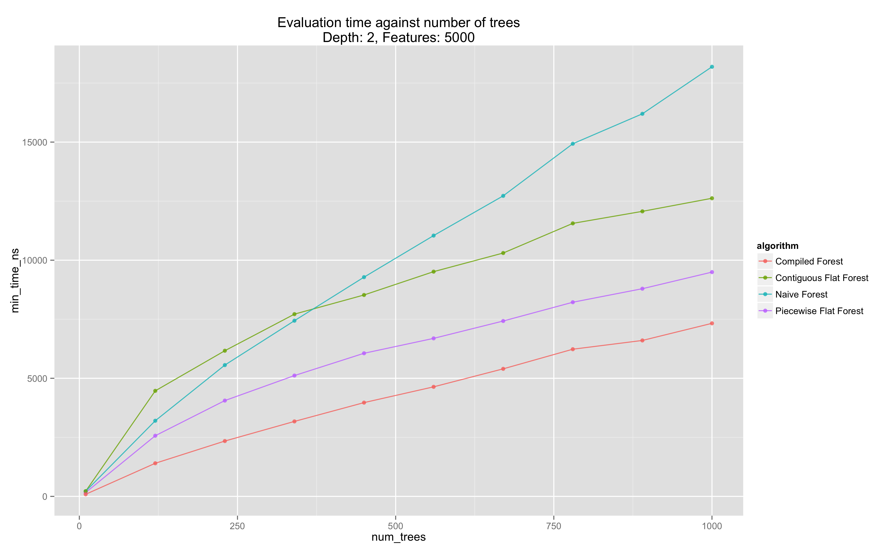
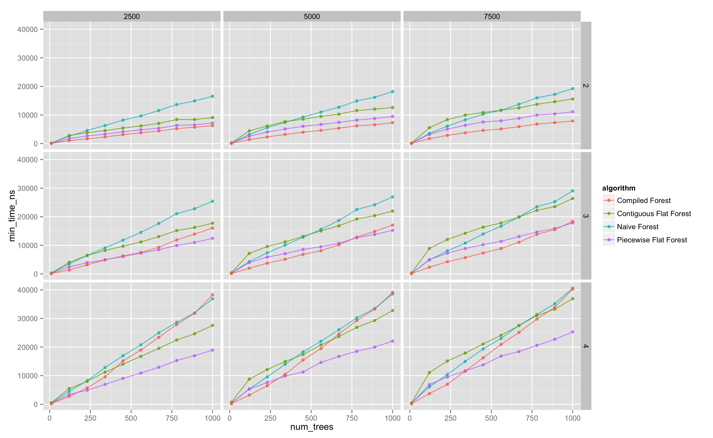

[Our previous article][speeding-up-training] on decision trees dealt
with techniques to speed up the evaluation process, though often the
performance-critical component of the machine learning pipeline is the
prediction side. Training takes place offline, whereas predictions are
often in the hot path - consider ranking documents in response to a
user query *a-la* Google, Bing, etc. Many candidate documents need to
be scored as quickly as possible, and the top *k* results returned to
the user.

Here, we'll focus on on a few methods to improve the performance of
evaluating an ensemble of decision trees - encompassing random
forests, gradient boosted decision trees, AdaBoost, etc.

There are three methods we'll focus on here:

* Recursive tree walking (*naive*)
* Flattening the decision tree (*flattened*)
* Compiling the tree to machine code (*compiled*)

We'll show that choosing the right strategy can improve evaluation
time by more than 2x - which can be a very significant performance 
improvement indeed.

All code (implementation, drivers, analysis scripts) are available on
GitHub at the [decisiontrees-performance][] repository.

Naive Method
------------

Superficially, [decision tree][] evaluation is fairly simple - given a
feature vector, recursively walk down the tree, using the given
feature vector to choose whether to proceed down the left branch or
the right branch at each point.  When we reach a leaf, we just return
the value at the leaf.

In Haskell, 

In C++,

From now on, we'll focus on the C++ implementation, and how we can
speed this up.

This approach has a few weaknesses - data cache behavior is
pretty-much the worst case, since we're jumping all over our memory to
go from one node to the next.  Given the cost of cache misses on
modern CPU architectures, we'll most likely see some performance
improvements from optimizing this approach.

Flattened Tree Method
---------------------

A nice trick to improve cache locality is to lay out data out in a
flattened form, and jumping in between locations in our flattened
representation. This is analogous to
[representing a binary heap as an array][binary-heap].

The technique is just to flatten the tree out, and so moving from the
parent to the child in our child will often mean accessing memory in
the same cache line - and given the cost of cache misses on modern CPU
architectures, minimizing these can lead to significant performance
improvements.  Thus our 

We implement two strategies along this approach:

* *Piecewise flattened*, where for an ensemble of weak learners, we
  store a vector of flattened trees - with one element for each weak learner.
* *Contiguous flattened*, where we concatenate the flattened
   representation of each weak learner into a single vector, and store
   the indices of the root of each learner.  In some circumstances,
   this may improve cache locality even more, though we see that it is
   outperformed in most circumstances by the piecewise flattened approach.

Our implementation is given below:

Compiled Tree Method
--------------------

A really cool technique that has been known for years is generating C
code representing a decision tree, compiling it into a shared library,
and then loading the compiled decision tree function via `dlopen(3)`.
I found [a 2010 UWash student report][compiled-decision-tree]
describing this technique, though the earliest reference I've seen is
from approximately 2000 in a presentation on Alta Vista's machine
learning system (which I unfortunately cannot find online).

The gist of this approach is to traverse the trees in the ensemble,
generating C code as we go. For example, if a regression stump has the
logic "return 0.02 if feature 5 is less than 0.8, otherwise return
0.08.", we would generate the code:

    float evaluate(float* feature_vector) {
      if (feature_vector[5] < 0.8) {
        return 0.02;
      } else {
        return 0.08;
      }
    }
      
For example, here is the code generated by a randomly constructed
ensemble with two trees:

The core C++ function used to generate this is given below:

For evaluation, we just use the `dlopen` and `dlsym` to extract a
function pointer from the generated `.so` file.

We can examine the evaluation time of each strategy at a fixed tree depth
and number of features, and see that at these levels, we have that the
compiled strategy is significantly faster.  Note that strategies scale
roughly linearly in the number of weak learners, as expected.

Performance Evaluation
----------------------

As [the student report][compiled-decision-tree] indicates, the
relative performance of each strategy depends on the size of the
trees, the number of trees, and the number of features in the given
feature vector.

Our methodology is to generate a random ensemble with a given depth,
number of trees, and number of features, construct the evaluators of
this tree for each strategy, and measure the evaluation time of each
strategy across a set of randomly generated feature vectors. (We also
check correctness of the implementations via a [QuickCheck][] style
test that each strategy computes the same result for a given feature vector).

\begin{align}
  \\text{num\_trees} &\in [1, 1000] \\\\
  \\text{depth} &\in [1, 6] \\\\
  \\text{num\_features} &\in [1, 10000]
\end{align}

### Visualization ###

We look at trellis plots of the evaluation time against number of
trees, for the various evaluation strategies.

The following diagram is the entire parameter space explored (click
for more detail).

### Regression ###

To quantify these effects on the cost of evaluation for the different
algorithms, we fit a linear model against these covariates,
conditioned on the algorithm used. Conceptually, we are just splitting
our dataset by the algorithm used, and fitting a separate linear model
on each of these subsets.

(as an aside - the R formula syntax is a great example of a DSL done
right.)

We see $R^2$ values ~0.75-0.85 with all coefficients, with almost all coefficients
statistically different from zero at the 0.1% level - so we can draw
some provisional inferences from this model.

We note:

* the compiled tree strategy is much more sensitive to the depth of
  the decision tree, which aligns with observations made in
  [the student report][compiled-decision-tree]. 
* the compiled tree strategy and the naive strategy are also more
  sensitive to the number of trees than the flattened evaluation
  strategy.  Thus for models with huge numbers of trees, the flattened
  evaluation may be the best.
* The intercept term for the compiled tree is the most negative - thus
  for 'small' models - low number of trees of small depth, the
  compiled tree approach may be the best evaluation strategy.

Conclusions
-----------

We've implemented and analyzed the performance of a selection of
decision tree evaluation strategies. It appears there are two main
conclusions:

* For small models - <200 or so trees with average depth <2, the
  compiled evaluation strategy is the fastest.
* For larger models, the piecewise flattened evaluation strategy is
  most likely the fastest.
* Choosing the right evaluation strategy can, in the right places,
  improve performance by greater than 2x.

Next, I'll look at implementing these methods in some commonly used
open-source ML packages, such as [scikit-learn][].

[QuickCheck]: http://en.wikipedia.org/wiki/QuickCheck
[binary-heap]: http://en.wikipedia.org/wiki/Binary_heap#Heap_implementation
[compiled-decision-tree]: http://courses.cs.washington.edu/courses/cse501/10au/compile-machlearn.pdf
[decision tree]: http://en.wikipedia.org/wiki/Decision_tree
[decisiontrees-performance]: https://github.com/ajtulloch/decisiontree-performance
[scikit-learn]: http://scikit-learn.org/stable/
[speeding-up-training]: http://tullo.ch/articles/speeding-up-decision-tree-training/
[the following diagram]: all_trellis.png
