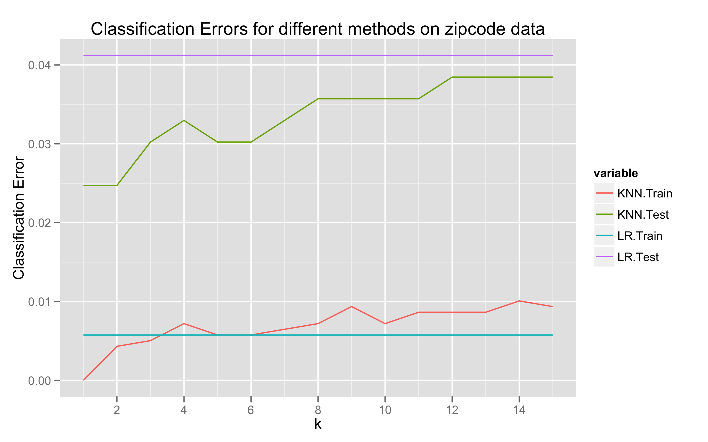

The Stanford textbook [Elements of Statistical Learning][esl] by
[Hastie][hastie], [Tibshirani][tibshirani], and [Friedman][friedman]
is an excellent (and [freely available][esl-download]) graduate-level
text in data mining and machine learning. I'm currently working
through it, and I'm putting my (partial) exercise solutions up for
anyone who might find them useful. The first set of solutions is for
Chapter 2, *An Overview of Supervised Learning*, introducing least
squares and *k*-nearest-neighbour techniques.

### Exercise Solutions

See the solutions in [PDF][chap2-pdf] format ([source][chap2-tex]) for
a more pleasant reading experience. This webpage was created from the
LaTeX source using the [LaTeX2Markdown](/projects/LaTeX2Markdown/)
utility - check it out on
[GitHub](https://github.com/ajtulloch/LaTeX2Markdown).

##  Overview of Supervised Learning

#### Exercise 2.1

> Suppose that each of $K$-classes has an associated target $t\_k$,
  which is a vector of all zeroes, except a one in the $k$-th
  position. Show that classifying the largest element of $\hat y$
  amounts to choosing the closest target, $\min\_k \\\| t\_k - \hat y
  \\\|$ if the elements of $\hat y$ sum to one.

#### Proof

The assertion is equivalent to showing that
\begin{equation}
\text{argmax}\_i \hat y\_i = \text{argmin}\_k \\\| t\_k - \hat y \\\|
= \text{argmin}\_k \\\|\hat y - t\_k \\\|^2 
\end{equation}
by monotonicity of $x \mapsto x^2$ and symmetry of the norm.

WLOG, let $\\\| \cdot \\\|$ be the Euclidean norm $\\\| \cdot
\\\|\_2$. Let $k = \text{argmax}\_i \hat y\_i$, with $\hat y\_k = \max
y\_i$. Note that then $\hat y\_k \geq \frac{1}{K}$, since $\sum \hat
y\_i = 1$.

Then for any $k' \neq k$ (note that $y\_{k'} \leq y\_k$), we have
\begin{align} \\\| y - t\_{k'} \\\|\_2^2 - \\\| y - t\_k \\\|\_2^2 &=
y\_k^2 + \left(y\_{k'} - 1 \right)^2 - \left( y\_{k'}^2 + \left(y\_k -
1 \right)^2 \right) \\\\ &= 2 \left(y\_k - y\_{k'}\right) \\\\ &\geq 0
\end{align} since $y\_{k'} \leq y\_k$ by assumption.

Thus we must have

\begin{equation}
  \label{eq:6}
  \text{argmin}\_k \\\| t\_k - \hat y \\\| = \text{argmax}\_i \hat y\_i 
\end{equation}

as required.

#### Exercise 2.2

> Show how to compute the Bayes decision boundary for the simulation
  example in Figure 2.5.

#### Proof

The Bayes classifier is
\begin{equation}
  \label{eq:2}
  \hat G(X) = \text{argmax}\_{g \in \mathcal G} P(g | X = x ).   
\end{equation}

In our two-class example $\textbf{orange}$ and $\textbf{blue}$, the
decision boundary is the set where

\begin{equation}
  \label{eq:5}
   P(g=\textbf{blue} | X = x) = P(g =\textbf{orange} | X = x) = \frac{1}{2}.
\end{equation}

By the Bayes rule, this is equivalent to the set of points where

\begin{equation}
  \label{eq:4}
  P(X = x | g = \textbf{blue}) P(g = \textbf{blue}) = P(X = x | g =
  \textbf{orange}) P(g = \textbf{orange}) 
\end{equation}

As we know $P(g)$ and $P(X=x|g)$, the decision boundary can be
calculated.

#### Exercise 2.3

> Derive equation (2.24)

#### Proof

TODO

    
#### Exercise 2.4

> Consider $N$ data points uniformly distributed in a $p$-dimensional
  unit ball centered at the origin. Show the the median distance from
  the origin to the closest data point is given by
  \begin{equation}
    \label{eq:7}
    d(p, N) = \left(1-\left(\frac{1}{2}\right)^{1/N}\right)^{1/p} 
  \end{equation}

#### Proof

Let $r$ be the median distance from the origin to the closest data
point. Then
\begin{equation}
  \label{eq:8}
  P(\text{All $N$ points are further than $r$ from the origin}) = \frac{1}{2}
\end{equation}
by definition of the median.

Since the points $x\_i$ are independently distributed, this implies
that 
\begin{equation}
  \label{eq:9}
   \frac{1}{2} = \prod\_{i=1}^N P(\\\|x\_i\\\| > r)
\end{equation}
and as the points $x\_i$ are uniformly distributed in the unit ball,
we have that
\begin{align}
  P(\\\| x\_i \\\| > r) &= 1 - P(\\\| x\_i \\\| \leq r) \\\\ &= 1 -
  \frac{Kr^p}{K} \\\\ &= 1 - r^p
\end{align}

Putting these together, we obtain that
\begin{equation}
  \label{eq:10}
  \frac{1}{2} = \left(1-r^p \right)^{N}  
\end{equation}
and solving for $r$, we have 
\begin{equation}
  \label{eq:11}
  r = \left(1-\left(\frac{1}{2}\right)^{1/N}\right)^{1/p}
\end{equation}

#### Exercise 2.5

> Consider inputs drawn from a spherical multivariate-normal
> distribution $X \sim N(0,\mathbf{1}\_p)$. The squared distance from
> any sample point to the origin has a $\chi^2\_p$ distribution with
> mean $p$. Consider a prediction point $x\_0$ drawn from this
> distribution, and let $a = \frac{x\_0}{\\\| x\_0\\\|}$ be an
> associated unit vector. Let $z\_i = a^T x\_i$ be the projection of
> each of the training points on this direction. 
>
> Show that the $z\_i$
> are distributed $N(0,1)$ with expected squared distance from the
> origin 1, while the target point has expected squared distance $p$
> from the origin.
> 
> Hence for $p = 10$, a randomly drawn test point is
> about 3.1 standard deviations from the origin, while all the
> training points are on average one standard deviation along
> direction a. So most prediction points see themselves as lying on
> the edge of the training set.

#### Proof

Let $z\_i = a^T x\_i = \frac{x\_0^T}{\\\| x\_0 \\\|} x\_i$. Then
$z\_i$ is a linear combination of $N(0,1)$ random variables, and hence
normal, with expectation zero and variance

\begin{equation}
  \label{eq:12}
  \text{Var}(z\_i) = \\\| a^T \\\|^2 \text{Var}(x\_i) = \text{Var}(x\_i) = 1
\end{equation}
as the vector $a$ has unit length and $x\_i \sim N(0, 1)$.

For each target point $x\_i$, the squared distance from the origin is
a $\chi^2\_p$ distribution with mean $p$, as required.

#### Exercise 2.6

> 1.  Derive equation (2.27) in the notes.
> 1.  Derive equation (2.28) in the notes.

#### Proof

1. We have
\begin{align}
  EPE(x\_0) &= E\_{y\_0 | x\_0} E\_{\mathcal{T}}(y\_0 - \hat y\_0)^2
  \\\\
  &= \text{Var}(y\_0|x\_0) + E\_{\mathcal T}[\hat y\_0 - E\_{\mathcal
    T} \hat y\_0]^2 + [E\_{\mathcal T} - x\_0^T \beta]^2 \\\\
  &= \text{Var}(y\_0 | x\_0) + \text{Var}\_\mathcal{T}(\hat y\_0) +
  \text{Bias}^2(\hat y\_0).
\end{align}
We now treat each term individually. Since the estimator
is unbiased, we have that the third term is zero. Since $y\_0 = x\_0^T
\beta + \epsilon$ with $\epsilon$ an $N(0,\sigma^2)$ random variable,
we must have $\text{Var}(y\_0|x\_0) = \sigma^2$.
The middle term is more difficult. First, note that we have
\begin{align}
  \text{Var}\_{\mathcal T}(\hat y\_0) &= \text{Var}\_{\mathcal
    T}(x\_0^T \hat \beta) \\\\ &= x\_0^T \text{Var}\_{\mathcal T}(\hat
  \beta) x\_0 \\\\ &= E\_{\mathcal T} x\_0^T \sigma^2 (\mathbf{X}^T
  \mathbf{X})^{-1} x\_0
\end{align} by conditioning (3.8) on $\mathcal T$.
1. TODO

#### Exercise 2.7

> Consider a regression problem with inputs $x\_i$ and outputs $y\_i$,
> and a parameterized model $f\_\theta(x)$ to be fit with least squares.
> Show that if there are observations with *tied* or *identical* values
> of $x$, then the fit can be obtained from a reduced weighted least
> squares problem.

#### Proof

This is relatively simple. WLOG, assume that $x\_1 = x\_2$, and all
other observations are unique. Then our RSS function in the general
least-squares estimation is

\begin{equation}
  \label{eq:13}
  RSS(\theta) = \sum\_{i=1}^N \left(y\_i - f\_\theta(x\_i) \right)^2 =
  \sum\_{i=2}^N w\_i \left(y\_i - f\_\theta(x\_i) \right)^2
\end{equation}

where
\begin{equation}
  \label{eq:14}
  w\_i = \begin{cases} 2 & i = 2 \\\\ 1 & \text{otherwise} \end{cases}
\end{equation}

Thus we have converted our least squares estimation into a reduced
weighted least squares estimation. This minimal example can be easily
generalised.

#### Exercise 2.8

> Suppose that we have a sample of $N$ pairs $x\_i, y\_i$, drawn IID
> from the distribution such that \begin{align} x\_i \sim h(x), \\\\
> y\_i = f(x\_i) + \epsilon\_i, \\\\ E(\epsilon\_i) = 0, \\\\
> \text{Var}(\epsilon\_i) = \sigma^2. \end{align} We construct an
> estimator for $f$ linear in the $y\_i$,
> \begin{equation}
>   \label{eq:16}
>   \hat f(x\_0) = \sum\_{i=1}^N \ell\_i(x\_0; \mathcal X) y\_i
> \end{equation}
> where the weights $\ell\_i(x\_0; X)$ do not depend on the $y\_i$,
> but do depend on the training sequence $x\_i$ denoted by $\mathcal
> X$. 
> 1. Show that the linear regression and $k$-nearest-neighbour
> regression are members of this class of estimators. Describe
> explicitly the weights $\ell\_i(x\_0; \mathcal X)$ in each of these
> cases. 
> 1. Decompose the conditional mean-squared error
> \begin{equation}
>   \label{eq:17}
>   E\_{\mathcal Y | \mathcal X} \left( f(x\_0) - \hat f(x\_0) \right)^2 
> \end{equation}
> into a conditional squared bias and a conditional variance
> component. $\mathcal Y$ represents the entire training sequence of
> $y\_i$. 
> 1. Decompose the (unconditional) MSE
> \begin{equation}
>   \label{eq:18}
>   E\_{\mathcal Y, \mathcal X}\left(f(x\_0) - \hat f(x\_0) \right)^2
> \end{equation}
> into a squared bias and a variance component. 
> 1. Establish a relationship between the square biases and variances in
> the above two cases.

#### Proof

1. Recall that the estimator for $f$ in the linear regression case is
given by
\begin{equation}
  \label{eq:19}
  \hat f(x\_0) = x\_0^T \beta
\end{equation}
where $\beta = (X^T X)^{-1} X^T y$. Then we can simply write
\begin{equation}
  \label{eq:20}
  \hat f(x\_0) = \sum\_{i=1}^N \left( x\_0^T (X^T X)^{-1} X^T \right)\_i y\_i.
\end{equation}
Hence
\begin{equation}
  \label{eq:21}
  \ell\_i(x\_0; \mathcal X) = \left( x\_0^T (X^T X)^{-1} X^T \right)\_i.
\end{equation}
In the $k$-nearest-neighbour representation, we have
\begin{equation}
  \label{eq:22}
  \hat f(x\_0) = \sum\_{i=1}^N \frac{y\_i}{k} \mathbf{1}\_{x\_i \in N\_k(x\_0)}
\end{equation}
where $N\_k(x\_0)$ represents the set of $k$-nearest-neighbours of
$x\_0$. Clearly,
\begin{equation}
  \label{eq:23}
  \ell\_i(x\_0; \mathcal X) = \frac{1}{k} \mathbf{1}\_{x\_i \in N\_k(x\_0)}
\end{equation}

1. TODO
1. TODO
1. TODO

#### Exercise 2.9

> Compare the classification performance of linear regression and
> $k$-nearest neighbour classification on the `zipcode` data. In
> particular, consider on the `2`'s and `3`'s, and $k = 1, 3, 5, 7, 15$.
> Show both the training and test error for each choice.

#### Proof

Our implementation in R and graphs are attached.

#### Exercise 2.10

> Consider a linear regression model with $p$ parameters, fitted by
> OLS to a set of trainig data $(x\_i, y\_i)\_{1 \leq i \leq N}$ drawn
> at random from a population. Let $\hat \beta$ be the least squares
> estimate. Suppose we have some test data $(\tilde x\_i, \tilde
> y\_i)\_{1 \leq i \leq M}$ drawn at random from the same population
> as the training data. If $R\_{tr}(\beta) = \frac{1}{N} \sum\_{i=1}^N
> \left(y\_i \beta^T x\_i \right)^2$ and $R\_{te}(\beta) = \frac{1}{M}
> \sum\_{i=1}^M \left( \tilde y\_i - \beta^T \tilde x\_i \right)^2$,
> prove that
> \begin{equation}
>   \label{eq:15}
>   E(R\_{tr}(\hat \beta)) \leq E(R\_{te}(\hat \beta))
> \end{equation}
> where the expectation is over all that is random in each expression.

[esl]: http://statweb.stanford.edu/~tibs/ElemStatLearn/
[esl-download]: http://www.stanford.edu/~hastie/local.ftp/Springer/ESLII_print5.pdf
[hastie]: http://www.stanford.edu/~hastie/
[tibshirani]: http://statweb.stanford.edu/~tibs/
[friedman]: http://statweb.stanford.edu/~jhf/
[chap2-pdf]: /static/ESL-Solutions.pdf
[chap2-tex]: /static/ESL-Chap2Solutions.tex
