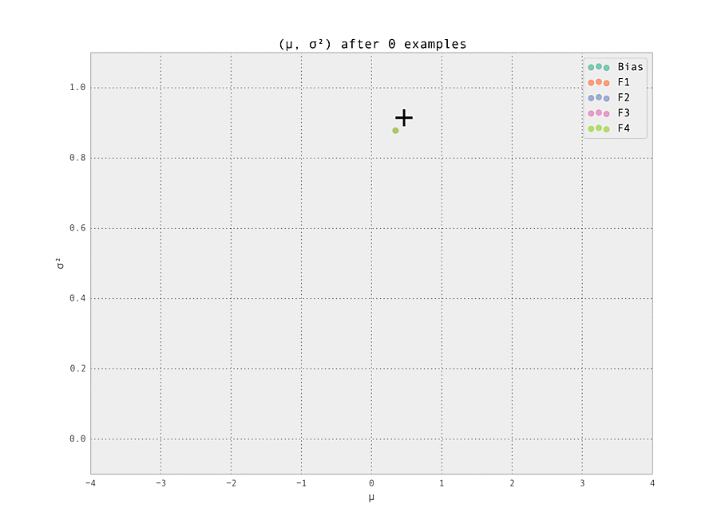

Online learning (as opposed to more traditional batched machine
learning) is more and more commonly applied to training machine
learned models at scale. The chief advantage is that the model is
trained via a streaming approach, and thus the entire dataset used
when training does not need to be held in memory at any given time.

That is to say, we can consider that a model parameters have a current
state $\mathbf{w}$, and we observe our examples $(y, \mathbf{x})$ with
($y$ the label and $x$ the features of the given example) in a
streaming fashion. At each example, we update our weights from the
given example, and these weights are used as a starting point.

Microsoft's [AdPredictor][] model from ICML 2010 is an online learning
model that has been successfully applied in the context of click
prediction for online advertising. 

Here, we'll implement the AdPredictor algorithm (in Python), and
demonstrate how online learning works via visualizations of the
trained parameters $\mathbf{w}$.

The AdPredictor Algorithm
-------------------------

From the paper's abstract,

> We describe a new Bayesian click-through rate (CTR) prediction
> algorithm used for Sponsored Search in Microsoft’s Bing search engine.
> The algorithm is based on a probit regression model that maps discrete
> or real-valued input features to probabilities. It maintains Gaussian
> beliefs over weights of the model and performs Gaussian online updates
> derived from approximate message passing. Scalability of the algorithm
> is ensured through a principled weight pruning procedure and an
> approximate parallel implementation. We discuss the challenges arising
> from evaluating and tuning the predictor as part of the complex system
> of sponsored search where the predictions made by the algorithm decide
> about future training sample composition. Finally, we show
> experimental results from the production system and compare to a
> calibrated Naïve Bayes algorithm.

The online [probit regression][] model described in the paper is
superficially similar to the more commonly known [logistic regression][],
with sampling distribution of the model given by

\begin{align}
  P(y = +1 \, | \, \mathbf{x}, \mathbf{w}) = \Phi \left( \frac{\langle
  \mathbf{w}, \mathbf{x} \rangle}{\beta} \right)
\end{align}

where $\mathbf{w}$ are the set of weights, $\mathbf{x}$
are the set of features for the given event, $\beta$ is a model
hyper-parameter, and $\Phi$ is the CDF of the normal distribution.

The weights $w\_{i, j}$ are Gaussian distributed, with mean
$\mu\_{i,j}$ and variance $\sigma^2\_{i, j}$ (where $i$ indexes over
features and $j$ indexes over the values for the feature).

The paper then proceeds to construct the [graphical model][] show in
Figure 1 of the paper, and derive the approximate update equations
from message passing in the factor graph.  The update equations are 

\begin{align}
  \mu\_{i, j} &\leftarrow \mu\_{i, j} + y \cdot x\_{i, j} \cdot
  \frac{\sigma^{2}\_{i, j}}{\Sigma} \cdot v \left(\frac{y \cdot \langle
  \mathbf{x}, \mathbf{\mu} \rangle}{\Sigma} \right) \\\\
  \sigma^{2}\_{i, j} &\leftarrow \sigma^{2}\_{i, j} \left(1 - x\_{i, j}
  \cdot \frac{\sigma^{2}\_{i, j}}{\sigma^{2}} \cdot w \left(\frac{y \cdot
  \langle \mathbf{x}, \mathbf{\mu} \rangle}{\Sigma} \right) \right)
\end{align} 

where $\Sigma^{2} = \beta^{2} + \langle \mathbf{x},
\mathbf{\sigma^{2}} \rangle$ represents the 'total variance' of the sample,
$v(t) = \frac{\phi(t)}{\Phi(t)}$ and $w(t) = v(t) \cdot (v(t) + t)$
represent the additive and multiplicative corrections to the truncated
Gaussian, with $\phi, \Phi$ being the PDF and CDF, respectively, of
the Normal distribution.

For further details on the derivation of this equation, see the
[AdPredictor][] paper and the [TrueSkill][] paper by the same authors
describing a similar algorithm, though with a more detailed treatment
of the underlying mathematics.

Implementation
--------------

The implementation is quite straightforward - see the example code in the
[AdPredictor repository][] on GitHub for more information.

The main body of the code is inlined below.

It's a fairly straightforward implementation of the equations
described previously. This approach doesn't deal at all with
distributed/parallelized inference, though that can be fairly nicely
incorporated into the AdPredictor framework as described in the
original paper.

Demonstration
-------------

We'll now test our implementation with a few demonstrations of the
model learning a ground truth in an online fashion.

To replicate these demonstrations, just run the following lines in
your terminal:

    $ git clone https://github.com/ajtulloch/adpredictor
    $ cd adpredictor
    $ virtualenv env && source env/bin/activate
    $ make demo

The setting is a simple one - we have five features (including the
bias), each with ten possible values (so fourty-one Gaussian weights
$w\_{i, j}$ in total are tracked). Of these features, we set one
weight to have a ground truth of having a strongly positive effect
($\mu\_{i, j} > 0$),
and one to have a strongly negative effect ($\mu\_{i, j} < 0$). These are labelled '+' and
'-' in the graphs below.  All other weights have zero effect
($\mu\_{i, j} = 0$).

The first demonstration illustrates how the weights are lazily
initialized and our Gaussian beliefs begin converging to the ground
truth.  

As the number of examples seen by the predictor increases, the weights
stabilize at their ground truth values.

Finally, we demonstrate the power of online learning by adjusting the
ground truth and seeing how our model adapts in real time. This can
happen naturally in an online advertising - perhaps a datasource
providing a feature goes down, or a campaign adjusts the
distribution of users seen by the model.  Being able to adapt in real
time is a very powerful advantage offered by online learned ML models.

Here, we simulate this by removing the adjustments to the two weights
mentioned above, so all weights have ground truth $\mu\_{i, j} = 0$.
This adjustment takes place after $N = 200$ examples have been seen.
We see the model rapidly learns the modified ground truth, as desired.

Conclusion
----------

We've introduced, implemented, and visualized the AdPredictor model
for online learning.
There are [many][] [other][] [approaches][] that are worth exploring
in future posts.

[AdPredictor repository]: https://github.com/ajtulloch/adpredictor
[AdPredictor]: http://research.microsoft.com/pubs/122779/adpredictor%20icml%202010%20-%20final.pdf
[TrueSkill]: http://research.microsoft.com/pubs/67956/NIPS2006_0688.pdf
[approaches]: http://jmlr.org/proceedings/papers/v15/mcmahan11b/mcmahan11b.pdf
[graphical model]: http://en.wikipedia.org/wiki/Graphical_model
[logistic regression]: https://en.wikipedia.org/wiki/Logistic_regression
[many]: http://www.cs.berkeley.edu/~jduchi/projects/DuchiHaSi10.pdf
[other]: http://people.cs.uchicago.edu/~kalai/papers/onlineopt/onlineopt.pdf
[probit regression]: http://en.wikipedia.org/wiki/Probit_model
