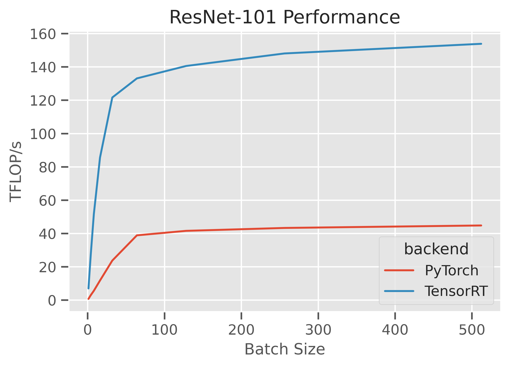
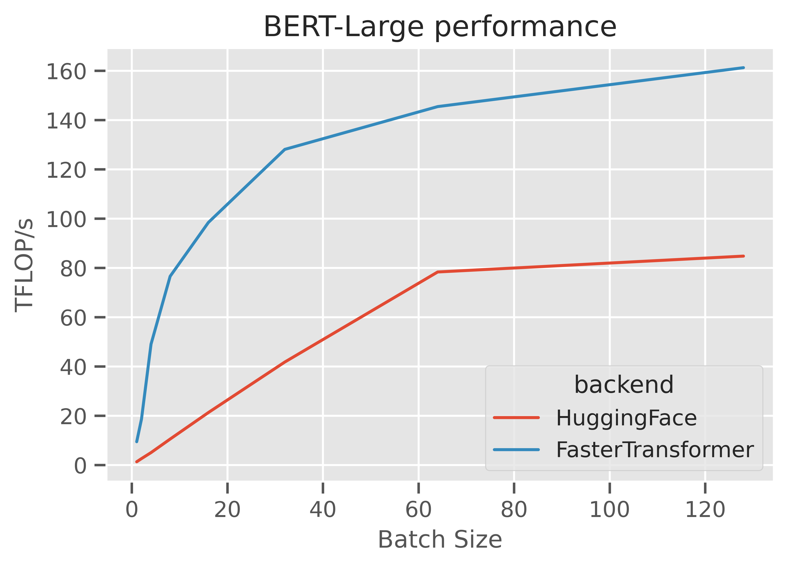

We hear a lot that ["machine learning systems are stuck in a rut"](https://dl.acm.org/doi/10.1145/3317550.3321441). This is might be expanded out as "standard architectures run  at high efficiencies due to disproportionate engineering effort, while theoretically better but non-standard architectures run at low efficiencies due to the lack of specialized engineering work on these alternatives and the failure of our systems to provide generalized performance."

This is a reasonable thesis. But as long as it is the status quo, we may as well enjoy the empirical efficiencies from standard architectures. That is, less "stuck-in-a-rut" thinking and more "pigs-at-a-trough" thinking! If you're going to use vanilla architectures and not play with the fanciest NAS-discovered variants, you may as well take advantage of their practical efficiency.

Out of the box, PyTorch doesn't necessarily provide the highest performance for these models. There are good (and bad) reasons for this, but regardless it's generally very simple to achieve very high [roofline](https://en.wikipedia.org/wiki/Roofline_model) efficiency during inference with a few simple steps.

Here, I'll just cover two quick examples: convolutional neural networks (where ResNet-101 is an exemplar rut architecture) and Transformer encoders (where BERT-Large is an exemplar rut architecture), run in float16 on NVIDIA GPUs. This is mostly focusing on the sweet spot of modern ML systems - large(ish) models, NVIDIA GPUs, half-precision, reasonably large batch sizes – and with a little work the results are great.

## Convolutional Neural Networks (ResNet-101)

The highest performance implementation of CNNs on NVIDIA GPUs these days is generally TensorRT.  TensorRT is a graph compilation library - users construct an old-school (i.e. the way we did things roughly 2 years ago) computation graph, and then hand it to TensorRT, which applies a bunch of optimizations (horizontal and vertical kernel fusion, kernel selection, memory planning, and so on).

There are a number of ways to go from a PyTorch model to a TensorRT graph. These include [`torch2trt`](https://github.com/NVIDIA-AI-IOT/torch2trt), [`fx2trt`](https://github.com/pytorch/pytorch/tree/master/torch/fx/experimental/fx2trt), [TRTorch](https://github.com/NVIDIA/TRTorch/), and [`torch.onnx.export`](https://pytorch.org/docs/stable/onnx.html) followed by [`trtexec`](https://docs.nvidia.com/deeplearning/tensorrt/developer-guide/index.html#trtexec-ovr).

These approaches all end up in roughly the same place - a new `nn.Module` instance which dispatches to the compiled TensorRT engine.  With `torch2trt`, this is literally a one-liner: `model = torch2trt(model, inputs)`.

Since this is right in the sweet spot of the NVIDIA stack (a huge amount of dedicated time has been spent making this workload fast), performance is great, achieving roughly 160TFLOP/s on an A100 GPU with TensorRT 8.0, and roughly 4x faster than the naive PyTorch implementation.

https://gist.github.com/ajtulloch/eb268da0ca7ca57d1c239460019183d8 is a fully-worked example.

## Transformer Encoders (BERT-Large)

Transformer encoders require just a few components to be well implemented to be reasonably fast: `nn.TransformerEncoderLayer`, `nn.MultiHeadAttention`, and so on if you're familiar with `torch.nn`, or the code underlying `transformers.BertModel` if you're more familiar with HuggingFace transformers. Again for some good and bad reasons, vanilla PyTorch doesn't implement these in the most performance-optimal way.

Luckily, there are a large number of libraries that have produced high-quality and performance tuned implementations of these primitives for inference. These include [NVIDIA FasterTransformer](https://github.com/NVIDIA/FasterTransformer), [ByteDance LightSeq](https://github.com/bytedance/lightseq), [Microsoft DeepSpeed](https://github.com/microsoft/DeepSpeed), and many more.

Leveraging these from a vanilla PyTorch Transformer implementation (from something like [`fairseq`](https://github.com/pytorch/fairseq), [HuggingFace transformers](https://huggingface.co/transformers/), or a [`nn.TransformerEncoder`](https://pytorch.org/docs/stable/generated/torch.nn.TransformerEncoder.html) is a mildly annoying but generally worthwhile exercise - extract out the weights from the vanilla model, reformat them for the target inference runtime, instantiate the new `nn.Module`, and swap out the old encoder instance for the optimized one.

There's really not much more to it than that. If you do this, you might expect roughly 2-4x improvements compared to a naive implementation, and again get to roughly 160TFLOP/s or more.

https://gist.github.com/ajtulloch/9c1e051e7389027d5d455c7afc052340 is a fully worked example of going between a HuggingFace BERT-Large transformer encoder and an equivalent FasterTransformer encoder, and [this post I wrote](https://dev-discuss.pytorch.org/t/making-transformer-inference-faster-on-gpus/190) goes into more detail.

## Keeping GPUs busy

The high roofline efficiencies quoted here occur at reasonably large batch sizes.  There's no real way of getting around it – GPUs need a reasonable amount of concurrent work to saturate the increasing number of SMs (up to 108 on the latest A100 GPU) and keep the tensor cores busy. There are a few complementary ways to achieve this in practice: use relatively wide models (where the non-batched dimensions are large), use batching, and use multiple streams at once. All of these help to improve the effective amount of work active on the GPU at once, and drive up achieved utilization.

In terms of increasing the effective amount of work at inference time, a good place to start would be to use a dynamic batching queue (first popularized by [DeepSpeech 2](https://arxiv.org/abs/1512.02595)) and implemented in [TorchServe](https://pytorch.org/serve/batch_inference_with_ts.html), [Triton](https://github.com/triton-inference-server/server), and many others. Then, look at increasing the number of streams, and ensure you aren't bottlenecked on the I/O or pre/post-processing.

As a rough guide to improving efficiency:

1. Ensure you are using half-precision on GPUs with `model.cuda().half()`
2. Ensure the whole model runs on the GPU, without a lot of host-to-device or device-to-host transfers.
3. Ensure you are running with a reasonably large batch size.
4. Ensure the input pipeline is reasonable (no egregiously slow Python pre/post-processing, etc).
5. Ensure the GPU kernels are well-optimized (e.g. enable TensorRT for CNNs, enable FasterTransformer for Transformers).

If you follow these steps, you should get very high efficiency on modern hardware. Occasionally there are upsides to our field being stuck in a rut :)
